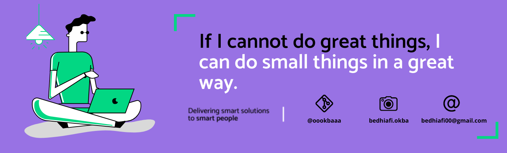

<h1 align="center">Hello I'm BEDHIAFI Okba</h1>
<h3 align="center">A passionate developer from Tunisia</h3>
 

   
  

  

## 👨🏻‍💻 About Me:

- 🙋‍♂️ All about me is at **[My Website](https://vercel.com/oookbaaas-projects)**

- 🔭 I’m currently working on `Something interesting`.

- 🌱 I’m currently learning `MERN Stack`

- 👯 I’m looking to collaborate for `Dev Projects`

- 🤔 I’m looking for help with `Competitive Programming`

- 💬 Ask me about anything, Except Maths :sweat_smile:

- 👨‍💻 Life Hack: Learn new tech :fire: and share what you have learned :tada:

- ⚡ Fun fact: I waste most of my time playing games

## 🛠️ Technologies and Tools I use:

                                  

## ❤️ Let's get connected:

## 🤝 Support Me:

## 📊 Stats:

&nbsp;

